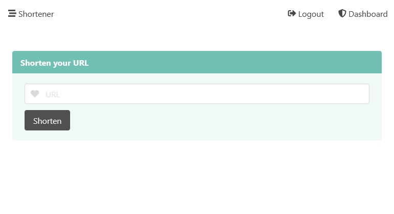

[![ci-badge][]][ci]

# shortener

Simple URL shortener made using Tide to showcase how a simple Rust web app could be made.

[ci]: https://github.com/Elinvynia/shortener/actions?query=workflow%3ARust
[ci-badge]: https://img.shields.io/github/workflow/status/Elinvynia/shortener/Rust/master?style=flat-square
